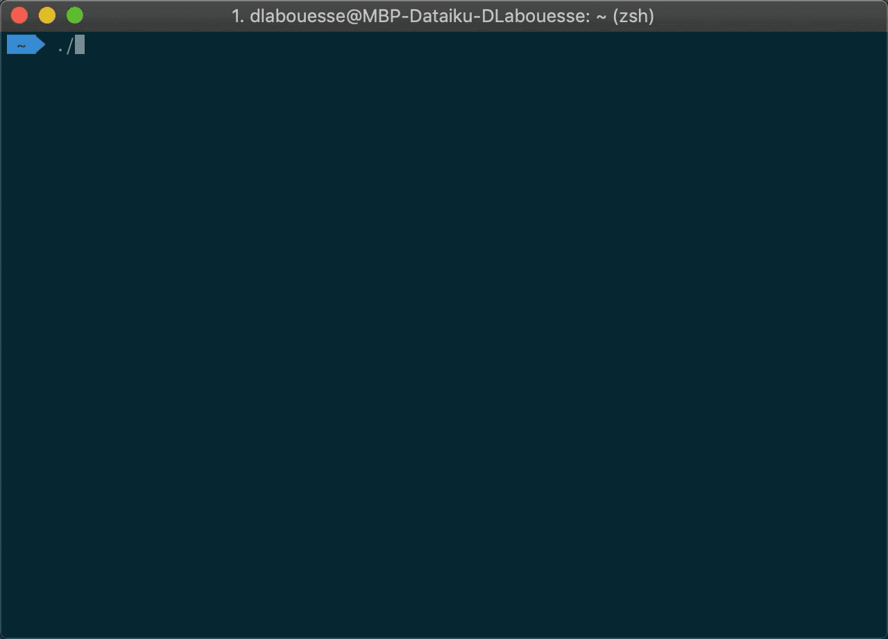

# Introduction
The purpose of `dku-installer.sh` script is to automatically install the following Dataiku nodes in one single command:
- Design node
- Automation node
- API node

It has been designed to allow having multiple versions of each nodes on the same instance and can install the 3 nodes using either empty of migrated data directories.

Then the `dku-launcher.sh` scripts allow you to start and stop any nodes which have been installed using the installer script.

# Installation & first use
1. Go to your local folder where you want to install all the Dataiku versions.
2. Clone this repository using `git clone https://github.com/dlabouesse/dku-installer.git`
3. Run the following commands to create symlinks from the git folder `ln -s dku-installer/dku-installer.sh dku-installer.sh && ln -s dku-installer/dku-launcher.sh dku-launcher.sh`
4. Make sure you have the rights to run the scripts `chmod +x dku-installer/dku-installer.sh dku-installer/dku-launcher.sh`
5. Copy any [Dataiku installer](https://downloads.dataiku.com/public/dss/) in the `.tar.gz` format in the current directory
6. Run the installer `./dku-installer.sh -f dataiku-dss-5.1.2-osx.tar.gz` (See below for further details)
7. Then, start the nodes you want by running `./dku-launcher.sh`

# How to use?
The `dku-installer.sh` script accepts the following input options:
- **Dataiku installer**

The path to the Dataiku installer in the `.tar.gz` format must be set using the `-f` option.

`./dku-installer.sh -f dataiku-dss-5.1.2-osx.tar.gz`

- **`DATA_DIR` to migrate (optional)**

The path to the `DATA_DIR` to migrate can be set using the `-d` option.

`./dku-installer.sh -f dataiku-dss-5.1.2-osx.tar.gz -d DSS_5_1_1`

- **License file (optional)**

The path to the licence file can be set using the `-l` option.
*There is no need to use this option when using `-d` since the license is already included in the `DATA_DIR` to migrate.*

`./dku-installer.sh -f dataiku-dss-5.1.2-osx.tar.gz -l license.json`

# Running details
## Directories
This script creates a folder depending of the version of Dataiku you want to install, that will respects the following schema `DSS_$VERSION` (e.g `DSS_5_0_3`).
Then, it will extract the installer in this folder, and install the 3 nodes using the following `DATA_DIR` directories:
- Design node: `/DSS_$VERSION/dss_home`
- Automation node: `/DSS_$VERSION/dss_home_automation`
- API node: `/DSS_$VERSION/dss_home_apinode`

## Ports
Each node is installed on a port depending of the version of DSS and the instance type.

- **Before Dataiku DSS 7.0.0**, instances ports are composed of the version number, suffixed by the following number depending of the instance type:
    - Design node: `00` (e.g `50300`)
    - Automation node: `10` (e.g `50310`)
    - API node: `20` (e.g `50320`)
- **Starting from Dataiku DSS 7.0.0**, instances ports are calculated incrementaly to fit all 10-ports consecutive slots from the port number 52000 to 60000.

# More details
- [Dataiku public releases](https://downloads.dataiku.com/public/dss/)
- [Dataiku Reference doc](https://doc.dataiku.com/dss/latest/index.html)